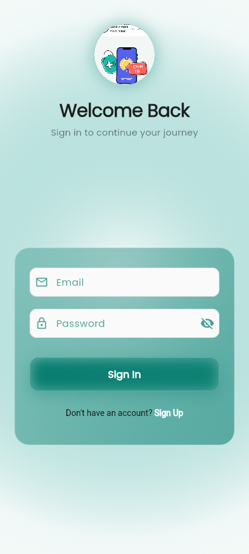
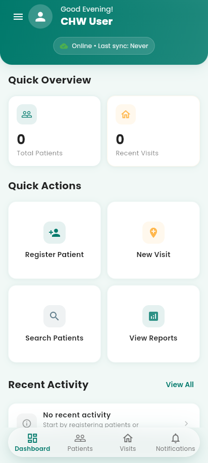
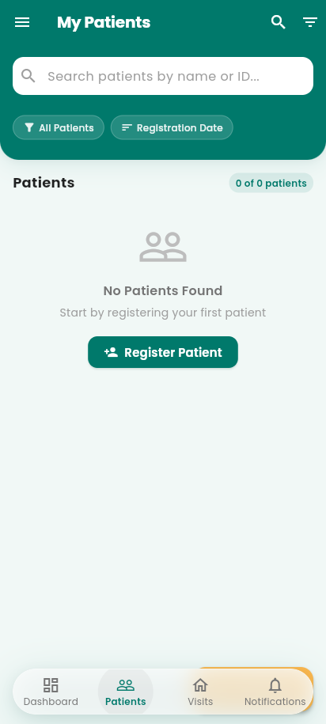
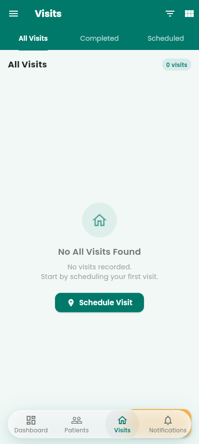
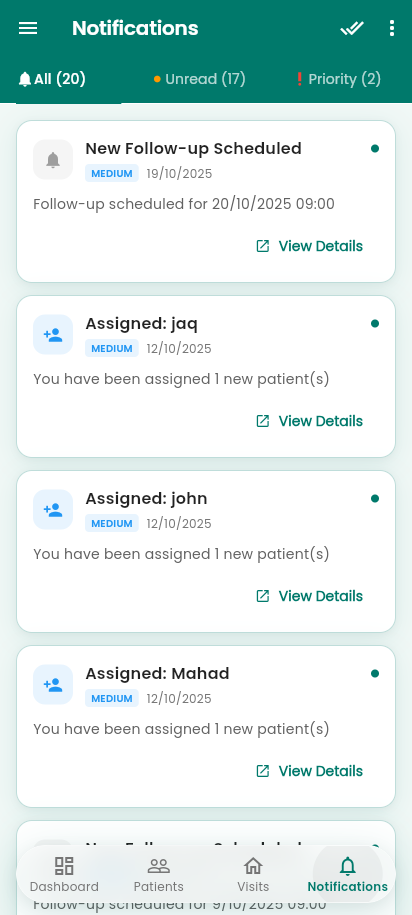
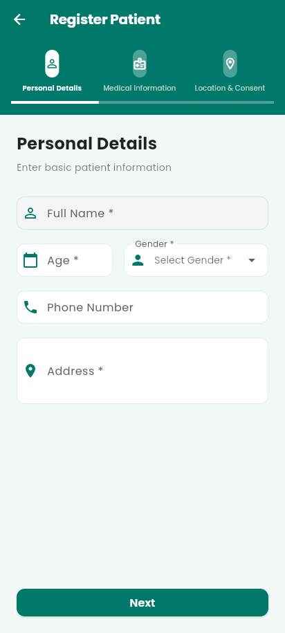
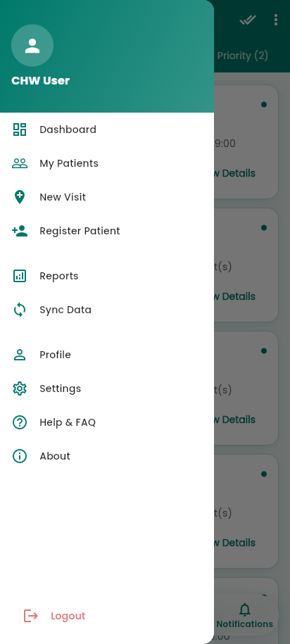
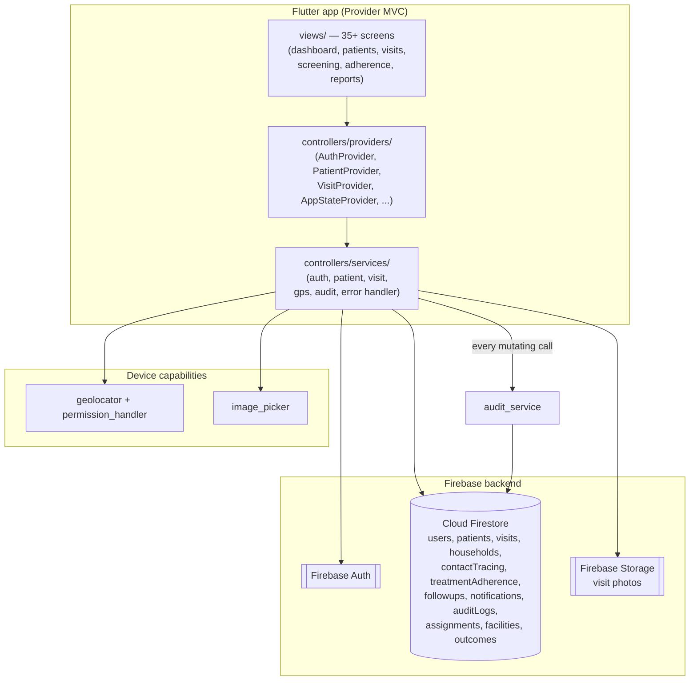

<div align="center">


# Community Health Worker — TB Tracker

**Lets a community health worker register TB patients, log GPS-tagged home visits, screen household contacts, track treatment adherence, and keep working offline in the field.**

A field data-collection and follow-up tool — not a diagnostic tool.

</div>

---

> [!IMPORTANT]
> This app does **not** diagnose tuberculosis, does **not** prescribe or adjust treatment, and does **not** replace clinical judgment. It records what the CHW observes in the field — visits, screenings, pill counts, side effects — and routes anything clinical to a referral. Diagnosis and treatment decisions always stay with the health facility.

## What it does

```
Sign in as a CHW (Firebase Auth)
        │
        ▼
 register a TB patient (demographics, TB status, GPS-tagged address)
        │
        ▼
 map the household & add members for contact screening
        │
        ▼
 log home visits (type, outcome, notes, GPS coordinates, photos)
        │
        ▼
 track treatment: adherence calendar, pill counts, side-effects log
        │
        ▼
 screen household contacts → refer symptomatic ones to a facility
        │
        ▼
 dashboard shows caseload stats, recent activity, missed follow-up alerts
        │
        ▼
 every write is audit-logged; Firestore syncs when connectivity returns
```

## Screenshots

| Sign in | Dashboard — caseload stats, quick actions |
|---|---|
|  |  |

| Patient list — search + status filters | Visits — tabs, filters, view switcher |
|---|---|
|  |  |

| Notifications — unread / priority tabs | Register patient — 3-step flow |
|---|---|
|  |  |

<div align="center">

<br/><em>Navigation drawer — full app map plus sync, profile, and logout</em>
</div>

---

## Architecture



**Audit boundary:** every create/update that a CHW performs is written through `audit_service` into the `auditLogs` collection alongside the actual data write — who did what, to which record, when. Accountability is enforced in the service layer, not left to convention.

### Why a service layer between providers and Firestore

Screens never talk to Firestore directly. Providers hold UI state; services own queries, writes, GPS capture, and audit logging. That means a data-model change touches one service file — not 35 screens — and every write path passes through the same audit and error-handling code (`error_handler.dart`) no matter which screen triggered it.

---

## Tech stack

| Layer | Choice | Why |
|---|---|---|
| Framework | Flutter (Dart ^3.9) | One codebase for the Android devices CHWs actually carry; Linux/macOS/web targets kept for development |
| State management | Provider | Lightweight, no codegen; `MultiProvider` at the root with per-domain providers (patients, visits, app state, auth) |
| Auth | Firebase Auth | Email/password CHW accounts with an `AuthGate` wrapper that routes signed-out users to sign-in |
| Database | Cloud Firestore | Offline persistence out of the box — field work can't assume connectivity; 12 normalized collections |
| Files | Firebase Storage | Visit photos captured via `image_picker` |
| Location | geolocator + permission_handler | GPS-stamps visits and patient addresses so supervisors can verify field work happened where reported |
| Typography | google_fonts (Poppins) | Single brand typeface via one theme file |
| Theming | Central `MadadgarTheme` | Teal/amber palette, spacing + radius + shadow tokens defined once in `lib/config/theme.dart` |
| Routing | Named routes via `AppRouter` | Central `onGenerateRoute` switch; every screen reachable by route name with typed argument handling |

### Why Firestore and not a REST backend

CHWs work in areas with unreliable connectivity. Firestore's local cache means reads and writes keep working offline and sync automatically when the network returns — without building a custom sync engine. The app also ships sync-status and offline-queue screens so the CHW can see what state their data is in.

---

## Project structure

```
Community-Health-Worker--User/
├── lib/
│   ├── main.dart                  # Firebase init, MultiProvider, MaterialApp + AuthGate
│   ├── firebase_options.dart      # generated by flutterfire configure
│   ├── config/
│   │   ├── theme.dart             # MadadgarTheme — colors, type scale, tokens, component themes
│   │   └── router.dart            # AppRouter — all named routes + argument parsing
│   ├── components/                # shared widgets (auth form, glass button, nav bar, route transitions)
│   ├── controllers/
│   │   ├── input_controllers.dart # form controllers + validation helper
│   │   ├── providers/             # AuthProvider, PatientProvider, VisitProvider, AppStateProvider, ...
│   │   └── services/              # auth, patient, visit, gps, audit, error handling, auth gate
│   ├── models/
│   │   ├── core_models.dart       # CHWUser, Patient, Visit, Household, HouseholdMember,
│   │   │                          # TreatmentAdherence, ContactTracing, Referral, ScreeningResult,
│   │   │                          # AuditLog, Followup, CHWNotification, Assignment, ...
│   │   └── medicine.dart          # Medication model
│   └── views/
│       ├── interface/authentication/   # sign in, sign up, forgot password
│       └── screens/                    # dashboard, patient list/details/register/edit,
│                                       # visits (list/new/edit/complete/details),
│                                       # household members, contact screening, screening results,
│                                       # treatment plan, adherence, pill count, side effects,
│                                       # notifications, reports, sync status, offline queue,
│                                       # settings, help/FAQ, about
├── android/ · ios/ · linux/ · macos/ · web/   # platform targets
├── assets/icons/                  # app logo
├── BACKEND_IMPLEMENTATION.md      # service/provider implementation guide
├── COMPLETE_IMPLEMENTATION_MAPPING.md
├── BUILD_OPTIMIZATION.md          # build tuning notes (+ build_optimized.sh)
└── firebase.json
```

---

## Data model

Twelve Firestore collections. The core chain mirrors how TB contact tracing actually works in the field:

```
users (CHW) ──▶ patients ──┬──▶ visits            (GPS, type, outcome, notes, photos)
                           ├──▶ households ──▶ (household members, embedded)
                           ├──▶ contactTracing    (screening of household contacts)
                           ├──▶ treatmentAdherence(dose status per day, pill counts)
                           ├──▶ followups         (scheduled / missed follow-up)
                           └──▶ outcomes          (treatment outcome per episode)

auditLogs      ◀── every mutating service call (actor, action, entity, timestamp)
notifications  ◀── follow-up alerts, missed-visit reminders per CHW
assignments    ── which CHW covers which patients / area
facilities     ── referral targets for symptomatic contacts
```

A `ContactTracing` record is the anchor for a screening workflow — each screened household member gets a status (`screened / pending`), a screening result, and, if symptomatic, a `Referral` pointing at a `Facility`. Adding a new visit type or TB status is a constant in `core_models.dart` (`VisitType`, `TBStatus`, `DoseStatus`), not a schema migration.

---

## Getting started

### Prerequisites

- [Flutter SDK](https://flutter.dev/docs/get-started/install) (Dart ≥ 3.9)
- [Firebase CLI](https://firebase.google.com/docs/cli) + [FlutterFire CLI](https://firebase.flutter.dev/docs/cli/)
- A Firebase project with **Auth (email/password)**, **Cloud Firestore**, and **Storage** enabled

### Setup

```sh
git clone https://github.com/Mahad-Ghauri/Community-Health-Worker--User.git
cd Community-Health-Worker--User
flutter pub get

# point the app at your Firebase project (regenerates lib/firebase_options.dart)
flutterfire configure

flutter run
```

An optimized Android build script is included:

```sh
./build_optimized.sh   # see BUILD_OPTIMIZATION.md
```

---

## Service layer reference

| Service | Purpose |
|---|---|
| `auth_service` | Sign in / sign up / sign out; CHW profile loading |
| `auth_gate` | Wraps the app; redirects signed-out users to the sign-in flow |
| `patient_service` | Patient CRUD, filtered/sorted queries, household linkage |
| `visit_service` | Visit CRUD, GPS-stamped visit creation, completion flow |
| `gps_service` | Location permission handling + coordinate capture |
| `audit_service` | Writes an `auditLogs` entry for every mutating action |
| `error_handler` | Central error mapping so screens show consistent failure states |

---

## Roadmap

### Up next
- **Persist remaining form fields** — a few captured inputs (screening facility/notes, side-effect onset date, treatment plan dates) are collected in the UI but not yet written through to Firestore
- **Calendar & map visit views** — the view switcher exists; both views are placeholders awaiting integration with visit data
- **Push notifications (FCM)** — notifications are currently Firestore-backed and in-app only

### Later
- Role-based dashboards (supervisor view over multiple CHWs)
- Localization (Urdu first) for field usability
- Dark mode (theme structure already supports a second `ThemeData`)
- Automated tests — there is currently no test coverage
- PDF/CSV export from the reports screen

### Explicitly avoided (and why)
- **A custom sync backend** — Firestore's offline persistence already covers the connectivity gap CHWs face; a hand-rolled sync engine would add failure modes without adding capability at this scale.
- **Clinical decision support** — the app deliberately stops at *recording and referring*. Flagging a contact as "symptomatic → refer to facility" is a checklist outcome, not a diagnosis; keeping that boundary hard is what makes the tool safe to put in non-clinician hands.
- **Storing anything the CHW didn't enter** — no background location tracking; GPS is captured only at the moment a visit or address is explicitly saved.

---

## Known limitations

- **Some form fields don't persist yet.** Screening facility/notes, side-effect onset dates, and treatment plan dates are captured in the UI but not saved — top of the roadmap.
- **Calendar and map visit views are placeholders.** The list view is fully functional; the other two render stub cards.
- **No automated tests.** `flutter_test` is configured but no suites exist yet.
- **Access recovery depends on Firebase Auth.** A CHW who loses account access loses app access; there is no offline-only mode without sign-in.
- **Single locale (English).** Field deployments will need Urdu at minimum.
- **Web build requires `google_fonts ≥ 6.3.3`** — earlier 6.3.x versions fail to compile on recent Dart SDKs (const-eval issue). `pubspec.yaml`'s `^6.3.1` constraint resolves correctly after `flutter pub upgrade google_fonts`.

---

## License

MIT — see [LICENSE](LICENSE).

## Disclaimer

This app is a field data-collection tool for community health workers operating under a supervising health program. It is not a medical device, does not provide medical advice or diagnosis, and must never be used as a substitute for evaluation by a qualified healthcare professional.
